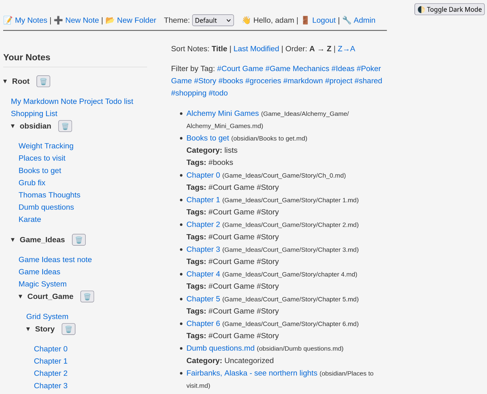
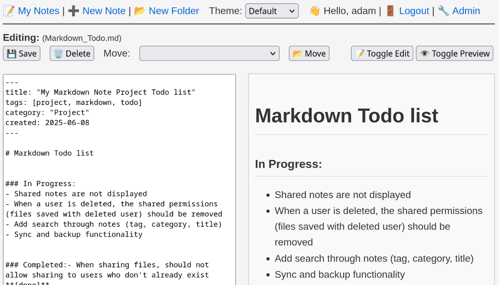
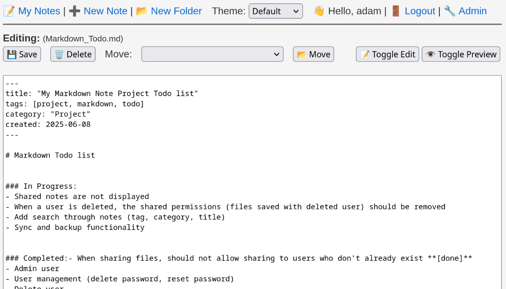
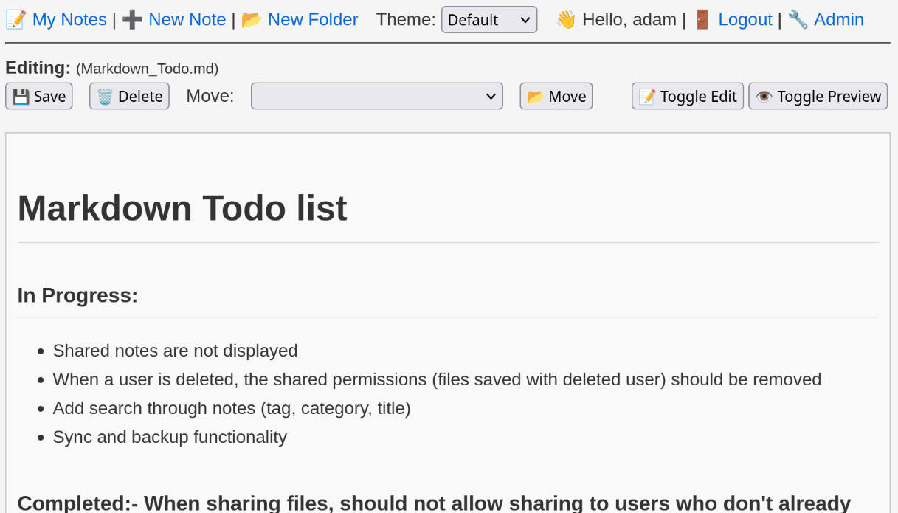
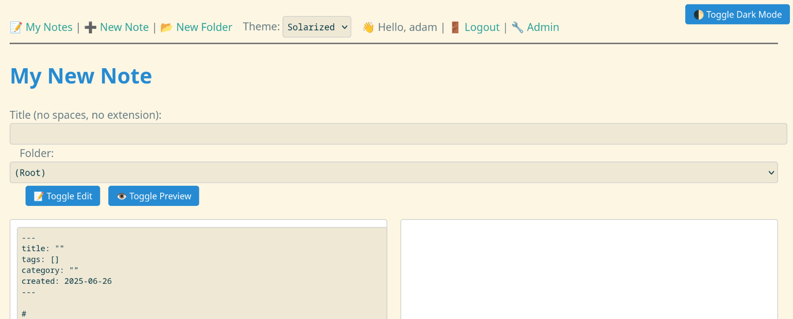
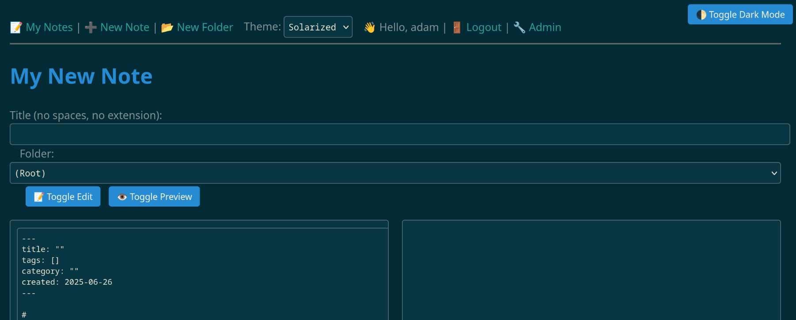

This project endeavors to be similar to Obsidian with an easy to use interface for saving notes organized by folders and tags.
- Supports multiple users
   - The project is currently setup with minimal security meant more for self hosting on a local network or single computer rather than more broadly.
- Supports all markdown courtesy of https://github.com/markedjs/marked
- Supports theming via css files (assumes each has a dark mode)
- Can customize a lot of meta data, sorting, etc. of notes for easy identification
- Notes autosave while being worked on. **Careful** this only works for notes already created and are editing! If you have not yet created the note, it will not autosave

**Screenshots**
- Browse your notes intuitively in the file structure or with metadata such as tags

- Show and hide the edit and preview window to keep focused on what's important

- Themes and dark mode

**Installation:**
- git clone https://github.com/Adamshrugged/MarkdownProject.git
- cd MarkdownProject/
- python3 -m venv venv
- source venv/bin/activate
- pip install --upgrade pip
- pip install -r requirements.txt

**Running:**
- Just localhost:
   - uvicorn main:app --reload
- Any domain:
   - uvicorn main:app --reload --host 0.0.0.0 --port 8080

You may need to update your firewall rules such as:
- sudo firewall-cmd --add-port=8080/tcp --permanent
- sudo firewall-cmd --reload